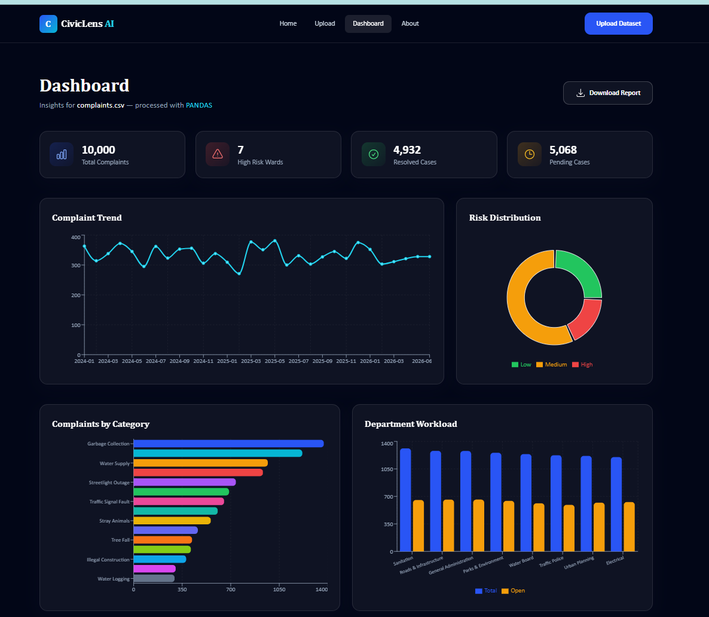
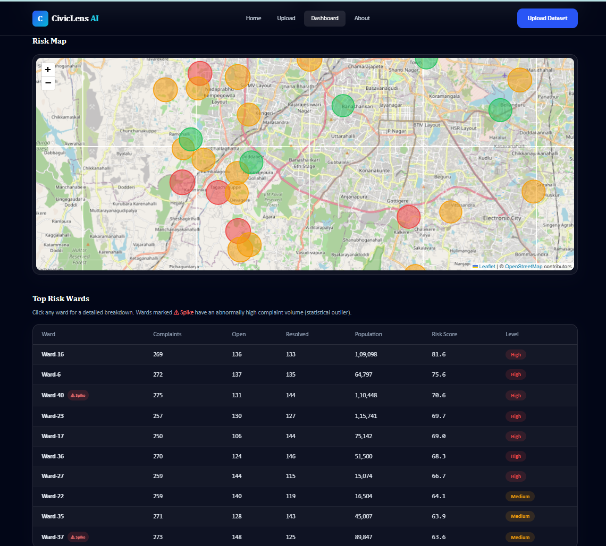
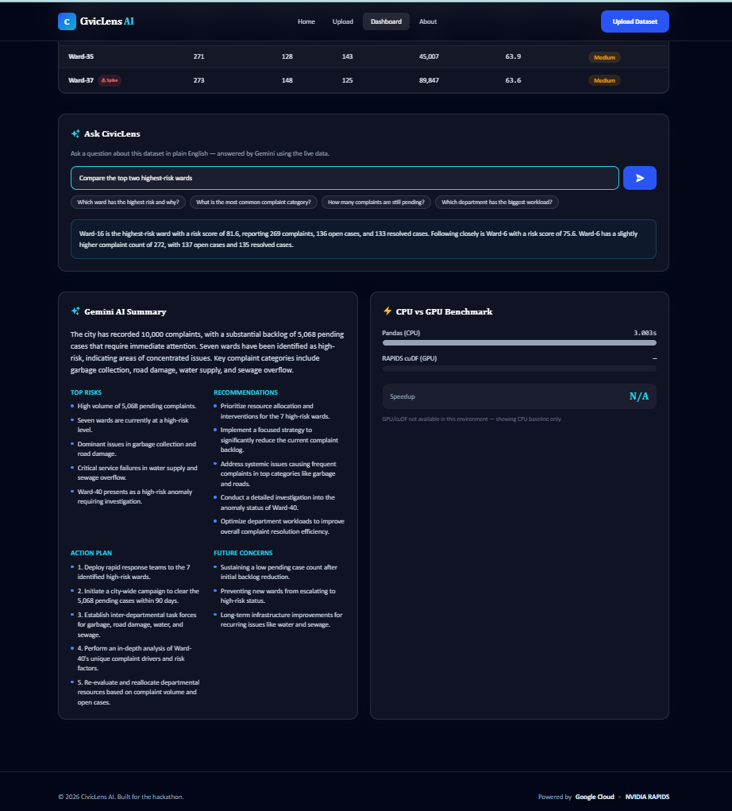

# CivicLens AI

**AI-Powered Community Intelligence Platform**

CivicLens AI helps city officials turn raw public-complaint data into fast,
confident decisions. Upload a CSV of complaints and get an instant risk
dashboard, an interactive risk map, anomaly detection, natural-language Q&A
powered by Google Gemini, GPU-accelerated processing benchmarks, and a
downloadable PDF report.

Built for the Google Cloud Gen AI Academy APAC Edition (Cohort 2) hackathon:
> "Create a data intelligence tool people would actually use, and show how
> acceleration helps them make a faster or better decision."

🔗 **Live app:** https://civic-lens-ai-three.vercel.app
🔗 **Backend API:** https://civiclens-backend-uxbc.onrender.com

---

## Overview

City departments receive thousands of complaints — water supply, road
damage, garbage collection, and more — but manually digging through
spreadsheets to find which wards need urgent attention is slow. CivicLens AI:

1. Cleans and validates uploaded complaint data.
2. Computes a weighted **risk score** per ward and flags **anomalies**.
3. Uses **NVIDIA RAPIDS (cuDF)** to accelerate processing, with an automatic
   Pandas fallback and a live **CPU vs GPU benchmark**.
4. Plots every ward on an **interactive risk map**, color-coded by risk.
5. Sends the aggregated analytics to **Google Gemini** to generate a
   plain-language summary, recommendations, an action plan, and to answer
   free-text questions ("Ask CivicLens").
6. Displays everything in an interactive, modern dashboard — with one-click
   PDF report export.

---

## Features

- 📂 CSV upload with progress indicator and validation
- 🧹 Automatic data cleaning (dedup, missing values, normalization, date parsing)
- ⚡ GPU-accelerated data processing via NVIDIA RAPIDS / cuDF, with graceful CPU fallback
- 📊 Interactive dashboard: KPI cards, trend line, category breakdown, risk pie chart,
  ward leaderboard, department workload
- 🧮 Weighted ward risk scoring (complaint volume, priority mix, rainfall, traffic, population)
- 🚨 **Anomaly detection** — automatically flags wards with statistically abnormal complaint spikes
- 🗺️ **Interactive risk map** (Leaflet) — every ward plotted, color-coded by risk, sized by volume
- 🔍 **Per-ward drill-down** — click any ward for its category, status, and priority breakdown
- 💬 **Ask CivicLens** — natural-language Q&A over the live dataset, powered by Google Gemini
- 🤖 Gemini-generated summary, top risks, recommendations, action plan, and future concerns
- 📄 **Downloadable PDF risk report** — one-click, shareable deliverable for city teams
- 🏁 CPU vs GPU benchmark panel with measured speedup
- ☁️ Google Cloud Storage + BigQuery sync on upload
- 🌓 Dark, glassmorphic SaaS-style UI with Framer Motion animations

---

## What's New — Prototype Refinement Phase

This phase focused on adding functional depth, reliability, and polish:

- **Ask CivicLens** — a natural-language query feature; ask questions in plain
  English and get answers from Google Gemini grounded in the live dataset.
- **Interactive Risk Map** — a geospatial view (Leaflet) plotting every ward,
  color-coded by risk and sized by complaint volume, with detail popups.
- **Per-Ward Drill-Down** — clicking any ward opens a detailed breakdown of
  its complaint categories, statuses, and priorities.
- **Anomaly Detection** — the risk engine now flags wards whose complaint
  volume is a statistical outlier (> 1.5 std. dev. above the mean).
- **Downloadable PDF Report** — one-click export of a shareable ward risk report.
- **Reliability Hardening** — startup auto-preload of a sample dataset, SPA
  routing fixes, and cold-start handling so the live demo is always populated
  and never breaks for reviewers.

---

## Architecture

```
             ┌─────────────┐        ┌──────────────────┐
CSV Upload → │   React UI  │──────▶│   FastAPI Backend  │
             └─────────────┘        └────────┬──────────┘
                                              │
                     ┌────────────────────────┼─────────────────────────┐
                     ▼                        ▼                         ▼
             ┌───────────────┐       ┌────────────────┐        ┌────────────────┐
             │ Cloud Storage │       │  cuDF / Pandas  │        │  Gemini API     │
             │ + BigQuery    │       │  clean + score  │        │  AI insights    │
             │               │       │  + anomalies    │        │  + Ask CivicLens│
             └───────────────┘       └────────┬────────┘        └────────┬────────┘
                                               │                          │
                                               ▼                          │
                                     ┌──────────────────┐                │
                                     │ Dashboard JSON    │◀───────────────┘
                                     │ charts · map ·    │
                                     │ risk table · PDF  │
                                     └──────────────────┘
```

**Upload workflow:** Upload CSV → store locally → push to Cloud Storage →
load into BigQuery → read with cuDF if a GPU is available, else Pandas →
clean → compute risk scores, anomalies + analytics → return dashboard JSON.

**Deployment:** Frontend on **Vercel**, backend on **Render**. The same cuDF
code path activates automatically on any CUDA-enabled deployment.

---

## Folder Structure

```
CivicLens-AI/
├── frontend/                  React + Vite + TypeScript + Tailwind
│   ├── public/
│   └── src/
│       ├── components/        Navbar, Charts, StatCard, RiskTable,
│       │                      RiskMap, WardDetailModal, AskCivicLens, ...
│       ├── pages/             Landing, Upload, Dashboard, About
│       ├── hooks/             useDashboard
│       ├── services/          api.ts (Axios client)
│       └── utils/             types.ts, format.ts, reportGenerator.ts
├── backend/                   FastAPI + Pandas/cuDF
│   └── app/
│       ├── routers/           upload, dashboard, risk, gemini, benchmark, health
│       ├── services/          data_processing, risk_engine, analytics,
│       │                      gemini_service, gcp_service, benchmark_service
│       └── utils/             cleaning.py
├── sample_data/
│   └── complaints.csv         10,000+ row realistic sample dataset
├── docker-compose.yml
├── .env.example
└── README.md
```

---

## Tech Stack

| Layer        | Technology                                                                                              |
| ------------ | ------------------------------------------------------------------------------------------------------- |
| Frontend     | React, Vite, TypeScript, Tailwind CSS, React Router, Axios, Recharts, Leaflet, Framer Motion, jsPDF     |
| Backend      | FastAPI, Pandas, cuDF (optional GPU path), Pydantic, Uvicorn                                            |
| Google Cloud | Cloud Storage, BigQuery, Gemini API                                                                     |
| NVIDIA       | RAPIDS, cuDF                                                                                            |
| Deployment   | Vercel (frontend), Render (backend), Docker / Docker Compose (local)                                   |

---

## Installation

### Prerequisites

- Node.js 18+
- Python 3.11
- (Optional, for GPU acceleration) a CUDA-enabled GPU with RAPIDS/cuDF installed

### 1. Clone and configure environment

```
git clone https://github.com/sinchanacs24/CivicLens-AI-.git
cd CivicLens-AI
cp .env.example .env
# Fill in GEMINI_API_KEY and (optionally) your Google Cloud settings
```

### 2. Backend setup

```
cd backend
python -m venv .venv
source .venv/Scripts/activate   # macOS/Linux: source .venv/bin/activate
pip install -r requirements.txt
uvicorn app.main:app --reload --port 8000
```

The API will be live at `http://localhost:8000` with interactive docs at `http://localhost:8000/docs`.

**Optional GPU acceleration:** on a CUDA-enabled machine, additionally install:

```
pip install cudf-cu12 --extra-index-url=https://pypi.nvidia.com
```

If cuDF or a GPU isn't available, the backend automatically uses Pandas — no configuration needed.

### 3. Frontend setup

```
cd frontend
npm install
npm run dev
```

The app will be live at `http://localhost:5173`. It proxies `/api/*` requests to the backend at `http://localhost:8000`.

### 4. Try it out

1. Open `http://localhost:5173`.
2. Go to **Upload** and upload `sample_data/complaints.csv`.
3. View the **Dashboard** for risk scores, charts, the interactive map,
   AI insights, Ask CivicLens, and the CPU vs GPU benchmark.

---

## Google Cloud Setup (Optional)

CivicLens AI works fully **without** any Google Cloud configuration — the
Cloud Storage/BigQuery sync steps are best-effort and skipped if not
configured. To enable them:

1. Create a GCP project and note its `PROJECT_ID`.
2. Create a Cloud Storage bucket and set `GCS_BUCKET_NAME`.
3. Create a BigQuery dataset matching `BIGQUERY_DATASET`.
4. Create a service account with Storage Object Admin + BigQuery Data
   Editor roles. Locally, point `GOOGLE_APPLICATION_CREDENTIALS` at the JSON
   key file path; on hosts without a filesystem (e.g. Render), paste the JSON
   into the `GOOGLE_APPLICATION_CREDENTIALS_JSON` env var instead.

## Gemini API Setup

1. Get an API key from [Google AI Studio](https://aistudio.google.com/).
2. Set `GEMINI_API_KEY` in your `.env`.

If no key is set, `/gemini` and `/ask` return a graceful fallback instead of
failing, so the demo always works.

---

## Verified Evidence

**Google Cloud (2 services used):**

- ✅ Cloud Storage — uploaded CSVs verified in bucket `civiclens-hackathon-sinchanacs`
- ✅ BigQuery — complaint data loaded into `gen-lang-client-0885267984.civiclens.complaints` (10,040 rows, auto-detected schema)

**NVIDIA GPU Acceleration:**

- Benchmarked on a real Tesla T4 GPU (Google Colab) using an 800,000-row complaints dataset
- Pandas (CPU): 3.64s | cuDF (GPU): 1.25s | **Speedup: 2.92x**
- The live deployment runs on Pandas since free-tier hosting has no GPU; it honestly reports "GPU not available" rather than faking a number. The same `cuDF` code path in `backend/app/services/data_processing.py` runs automatically on any CUDA-enabled deployment.

---

## API Reference

| Method | Endpoint         | Description                                            |
| ------ | ---------------- | ------------------------------------------------------ |
| `POST` | `/upload`        | Upload and process a complaints CSV                    |
| `GET`  | `/dashboard`     | Full dashboard analytics for the last uploaded dataset |
| `GET`  | `/risk`          | Ward-level risk scores, anomaly flags, top risk wards  |
| `GET`  | `/ward/{name}`   | Detailed breakdown for a single ward                   |
| `POST` | `/gemini`        | Gemini-generated summary and recommendations           |
| `POST` | `/ask`           | Ask a natural-language question about the dataset      |
| `GET`  | `/benchmark`     | CPU (Pandas) vs GPU (cuDF) processing benchmark        |
| `GET`  | `/health`        | Health check                                           |

---


## Screenshots






## Future Improvements

- Persist datasets in a real database instead of in-memory state
- Multi-file / multi-source ingestion (APIs, IoT feeds, live databases)
- Dashboard filters (by risk level, category, or date range)
- Role-based access for different departments
- Looker / Vertex AI integration for deeper forecasting

---

## Links

- **Live app:** https://civic-lens-ai-three.vercel.app
- **GitHub:** https://github.com/sinchanacs24/CivicLens-AI-
- **Backend API:** https://civiclens-backend-uxbc.onrender.com

---

## License

Built for hackathon submission purposes.
